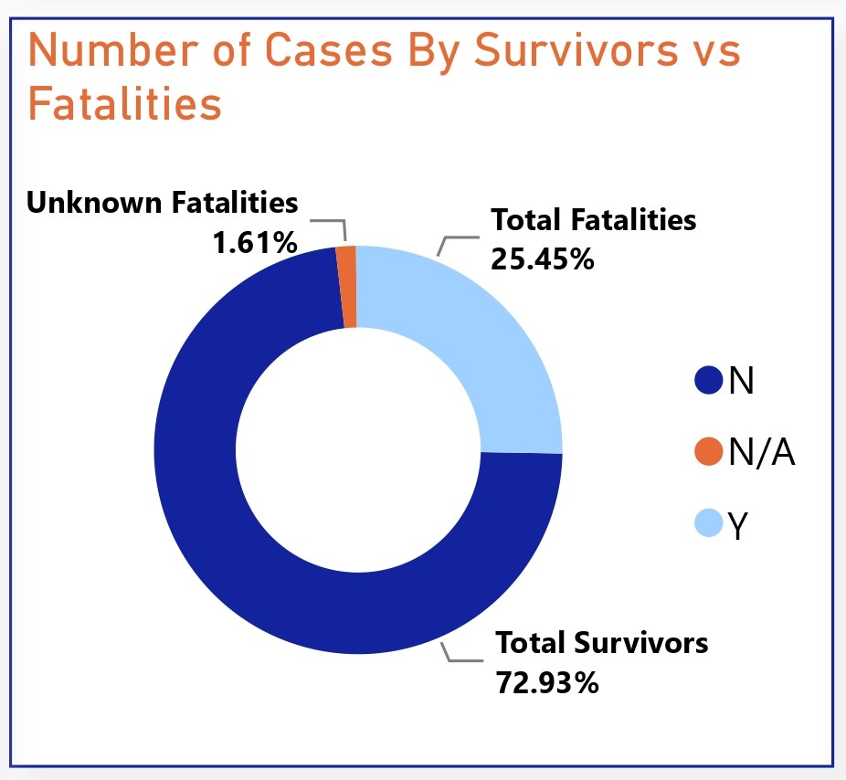

# Shark Attacks Analysis

## Project Overview

### Introduction:
The "Shark Attacks Analysis" project aims to investigate and analyze global shark attack data to gain insights into the patterns, trends, and factors associated with shark attacks. Through the examining of this data, geographical locations, species involved, environmental conditions, and human activities, the project seeks to provide an understanding of shark attacks, their frequency, and potential risk factors. Sharks Atacks Analysis contains Shark attacks reported over the past 100 years, including location, activity, victim info (name, gender, age), shark species, etc. The project aims to explore and analyze sharks attacks all around the world.

### Objectives:
- Analyze the data on shark attacks annually since 1900, and identify trends and patterns in shark attack occurrences over time.
- Identify the countries with the highest reported incidences of shark attacks and determine the specific areas and locations within those countries that exhibit higher levels of risk, providing insights into geographic hotspots for shark-human interactions.
- Practice data cleaning skills by preparing the raw dataset for analysis, ensuring consistency, accuracy, and suitability for further investigation.
- Perform text analysis on the "Injury" column to determine the body parts most frequently injured in shark attacks, providing valuable insights into the severity and nature of shark-related injuries.
- Transform the "Time" data to analyze the timing of shark attacks and ascertain whether certain parts of the day are associated with increased occurrence of shark-human interactions.
- Clean and analyze the data related to shark species involved in attacks to identify the species most frequently implicated in shark attacks, despite potential data inconsistencies and inaccuracies.

### Expected Outcomes:
- A comprehensive visualization illustrating the trends and patterns of shark attacks annually since 1900, facilitating a deeper understanding of the temporal evolution of shark-human interactions.
- Identification of countries with the highest incidence rates of shark attacks and pinpointing specific regions within these countries where shark encounters are most prevalent, aiding in the development of targeted safety measures and risk mitigation strategies.
- Cleaned and prepared dataset ready for analysis, ensuring reliable and accurate insights into various aspects of shark attacks.
- Insights into the body parts most commonly injured in shark attacks, informing medical and safety protocols for individuals at risk of shark encounters.
- Determination of whether certain times of day are associated with higher rates of shark attacks, potentially informing beach safety guidelines and public awareness campaigns.
- Identification of the shark species most frequently involved in attacks, despite data cleaning challenges, contributing to our understanding of species-specific behaviors and informing conservation efforts and management strategies aimed at reducing human-shark conflicts.

### Dataset Overview
The dataset used in this analysis is the "Attacks.csv" and was provided by [Quantum Analytics](https://www.quantumanalyticsco.org/). The "Attacks.csv" dataset contains information on shark attacks documented over a period of time. The dataset provides insights into various aspects of shark-human interactions, including the location, date, time, severity of injuries, shark species involved, and other relevant details pertaining to each recorded shark attack incident. You can access the dataset [here](attacks.csv).

This dataset is made up of a single table of data with 16 columns and 6,091 rows of data. Below is a description of the columns in this dataset for a better understanding of this analysis:
- __Case Number:__ A unique identifier for each shark attack incident.
- __Date:__ The date when the shark attack occurred.
- __Year:__ The year in which the shark attack took place.
- __Type:__ Describes the type of attack (e.g., provoked, unprovoked, invalid, etc.).
- __Country:__ The country where the shark attack occurred.
- __Area:__ The specific area or region within the country where the shark attack occurred.
- __Location:__ Provides details about the location of the shark attack (e.g., beach name, geographical coordinates, etc.).
- __Activity:__ Describes the activity being performed by the victim at the time of the shark attack.
- __Name:__ Name of the individual involved in the shark attack incident.
- __Sex:__ Gender of the individual involved in the shark attack.
- __Age:__ Age of the individual involved in the shark attack.
- __Injury:__ Specifies the type and severity of injuries sustained during the shark attack.
- __Fatal (Y/N):__ Indicates whether the shark attack resulted in a fatality (Y for yes, N for no).
- __Time:__ The time of day when the shark attack occurred.
- __Species:__ Specifies the shark species involved in the attack, if known.
- __Investigator or Source:__ Provides information about the source of the data or the investigator who documented the shark attack incident.

### Tools Used
1. Power Query Editor
    - Was used to:
        1. Extract,
        2. Transform, and
        3. Load all the datasets for this analysis.
           
2. Power BI (Was used to create reports and dashboard for this analysis)
    - The following Power BI Features were incorporated:
        1. DAX
        2. Quick Measures
        3. Page Navigation
        4. Filters
        5. Tooltips
        6. Button

### Data Cleaning, Transformation and Loading using the Excel and Power Query Editor:
1. Changed the columns
2. Teh total number of data rows before cleaning was 6,091 rows and it was reduced to 5,940 rows after cleaning.

**Raw Data**
- Below a screenshot of a part of the raw data in .csv file format. You can download the dataset [here](attacks.csv).

**Final Power Query Editor screenshot**
- Below is a screenshot of a part of the cleaned data in power query editor. You can access the full Power BI project document [here](https://github.com/Ugochukwuodinaka/Maternal-Health-Risk-Analysis/blob/main/MATERNAL%20HEALTH%20RISK%20ANALYSIS.pbix).

## Data Modelling
No data modelling was required since we need just a table for the analysis.

## Visualization in Power BI:
#### Report View 1

#### Report View 2

### Project Analysis:
From the analysis, i made the following Key findings below:
- The Total Number of Shark Attack Cases is __5,956.__
- The Total Number of Survivors are __4,341.__
- The Total Number of Fatalities are __1,515.__

- 
- **Casualty Cases By Activity:**
- In my analysis of the top 10 shark attack cases by activity, valuable insights are provided into the activities most commonly associated with shark-human interactions. Here are some key observations and insights:
- __Surfing Tops:__ Surfing emerges as the activity with the highest number of shark attack cases, totaling 934 incidents. This finding is consistent with the known behavior of sharks, which may mistake surfers paddling on surfboards for prey due to their silhouette and movement resembling that of potential prey species.
- __Swimming Vulnerability:__ Swimming ranks second in terms of shark attack cases, with 861 incidents recorded. Swimmers often spend extended periods in the water, potentially increasing the likelihood of encountering sharks. Additionally, swimmers may inadvertently attract sharks by splashing and creating disturbance in the water.
- __Fishing and Spear Fishing:__ Fishing-related activities, including fishing and spear fishing, account for a significant number of shark attack cases, with 419 and 328 incidents, respectively. These activities involve the use of bait and blood, which can attract sharks to the vicinity, increasing the risk of encounters.
- __Passive Activities:__ Activities such as bathing, wading, and standing are also associated with shark attack cases, albeit to a lesser extent compared to more active pursuits like surfing and swimming. Despite being relatively passive activities, individuals engaged in these activities are still susceptible to shark encounters, highlighting the unpredictable nature of shark behavior.
- __Diving and Snorkeling:__ Diving and snorkeling, which involve exploring underwater environments, have recorded fewer shark attack cases compared to other activities. However, these activities still carry inherent risks, especially in areas known to have high shark populations or where feeding behavior occurs.
- It is important to note that we have rows of data where the case activity wasn't provided, so we classfied this activity as "Not Provided" which has 511 cases. These cases highlight potential underestimation of risks associated with water-based activities and emphasize the importance of improving reporting completeness. 

- 
- **Number of Cases By Time of Day:**
- The analysis on the number of shark attack cases by time of day provides insights attacks distribution across the different periods of the day. Here are some key observations and insights:
- __Unprovided Cases Prevalence:__ The category of unprovided cases, totaling 3,146 instances, stands out as the highest among all time categories. This suggests a significant portion of the dataset lacks specific information regarding the time of day when shark attacks occurred. The prevalence of unprovided cases underscores the importance of complete and accurate data collection for conducting thorough analyses and understanding temporal patterns in shark attacks.
- __Afternoon Activity:__ Afternoon emerges as the time period with the second-highest number of shark attack cases, totaling 1,101 instances. The afternoon hours typically coincide with peak recreational activities in coastal areas, such as swimming, surfing, and diving, which may contribute to increased human presence in the water and higher likelihood of shark encounters.
- __Morning and Evening Incidents:__ Shark attack cases during the morning and evening hours are also notable, with 942 and 606 cases recorded, respectively. These time periods likely represent times when individuals engage in water-based activities, albeit to a lesser extent compared to the afternoon. Factors such as varying environmental conditions, prey availability, and human behavior may influence shark activity and interactions during these times of day.
- __Nighttime Vulnerability:__ The dataset records the fewest shark attack cases during the night, with only 161 instances reported. Nighttime activities in coastal areas are typically less common due to reduced visibility and safety concerns, potentially resulting in fewer opportunities for shark-human interactions. However, individuals engaged in night fishing or other nocturnal activities may still be at risk of encountering sharks.

- 
- **Number of Cases By Sex:**
- The data on the number of shark attack cases by sex provides insights into the gender distribution among individuals involved in these attacks. Key observations and insights on this is stated below:
- __Male Majority:__ The dataset indicates a significant predominance of male individuals among shark attack cases, with 4,820 incidents recorded. This finding suggests that males are more frequently involved in activities or situations that increase the likelihood of shark encounters, such as surfing, swimming, and diving, which are traditionally male-dominated recreational pursuits in coastal areas.
- __Female Representation:__ Female individuals account for a substantially lower number of shark attack cases, with 591 incidents reported. This disparity may reflect differences in activity participation rates between genders, with females potentially engaging in water-based activities less frequently or in different contexts compared to males. Additionally, societal factors or cultural norms may influence gender-specific behaviors and risk-taking tendencies in aquatic environments.
- __Unprovided Sex Information:__ A notable portion of the dataset comprises cases where the sex of the individual involved was not provided and was categorized as N/A, totaling 537 instances. The absence of sex information for these cases underscores the need for more enhanced data collection practices to ensure accurate reporting and analysis of shark attack incidents

- 
- **Number of Cases By Survivors or Fatalities:**
- This data analysis provides insights into the outcomes of shark-human interactions, including the proportion of individuals who survived the attacks compared to those who succumbed to their injuries. Here are some key observations and insights derived from the provided information:
- __Survival Rate:__ The majority of individuals involved in shark attack incidents survived, with 4,341 cases recorded as survivors. This accounts for approximately 72.93% of all reported cases, indicating that the majority of shark encounters result in non-fatal outcomes.
- __Fatalities:__ Despite the relatively high survival rate, a significant number of shark attack cases resulted in fatalities, with 1,515 deaths reported. Fatalities represent approximately 25.45% of all reported cases, highlighting the serious and potentially life-threatening nature of shark attacks. 
- __Unknown Outcomes:__ A small proportion of shark attack cases (96 instances) have unknown survivor or fatality status, accounting for approximately 1.61% of the total cases. The absence of information regarding the outcome of these cases shows the need for a better data collection and reporting strategy to ensure accurate assessment and analysis of shark attack incidents.

- 
- **Number of Cases By Survivors or Fatalities:**
- This data analysis
