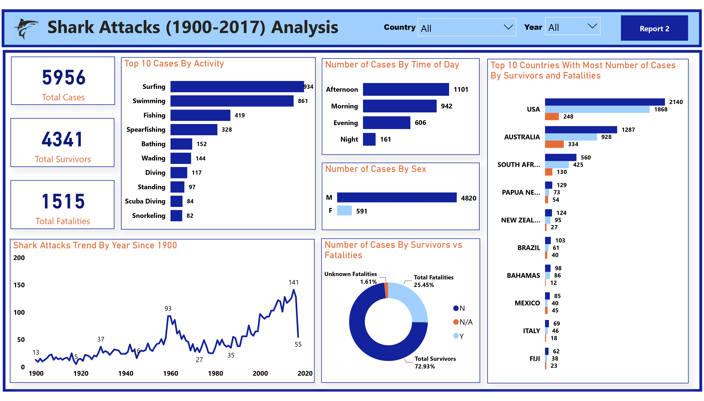
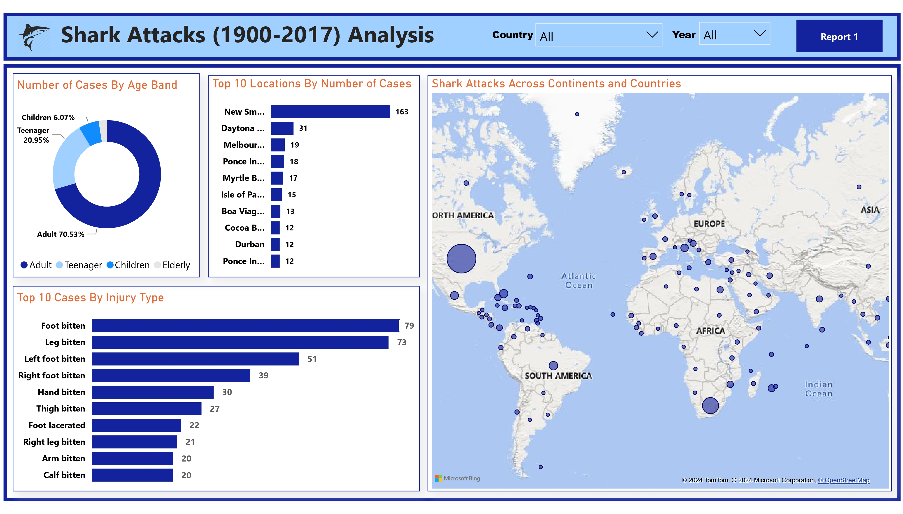

# Shark Attacks Analysis

## Project Overview

### Introduction:
The "Shark Attacks Analysis" project aims to investigate and analyze global shark attack data to gain insights into the patterns, trends, and factors associated with shark attacks. Through the examining of this data, geographical locations, species involved, environmental conditions, and human activities, the project seeks to provide an understanding of shark attacks, their frequency, and potential risk factors. Sharks Atacks Analysis contains Shark attacks reported over the past 100 years, including location, activity, victim info (name, gender, age), shark species, etc. The project aims to explore and analyze sharks attacks all around the world.

### Objectives:
- Analyze the data on shark attacks annually since 1900, and identify trends and patterns in shark attack occurrences over time.
- Identify the countries with the highest reported incidences of shark attacks and determine the specific areas and locations within those countries that exhibit higher levels of risk, providing insights into geographic hotspots for shark-human interactions.
- Practice data cleaning skills by preparing the raw dataset for analysis, ensuring consistency, accuracy, and suitability for further investigation.
- Perform text analysis on the "Injury" column to determine the body parts most frequently injured in shark attacks, providing valuable insights into the severity and nature of shark-related injuries.
- Transform the "Time" data to analyze the timing of shark attacks and ascertain whether certain parts of the day are associated with increased occurrence of shark-human interactions.
- Clean and analyze the data related to shark species involved in attacks to identify the species most frequently implicated in shark attacks, despite potential data inconsistencies and inaccuracies.

### Expected Outcomes:
- A comprehensive visualization illustrating the trends and patterns of shark attacks annually since 1900, facilitating a deeper understanding of the temporal evolution of shark-human interactions.
- Identification of countries with the highest incidence rates of shark attacks and pinpointing specific regions within these countries where shark encounters are most prevalent, aiding in the development of targeted safety measures and risk mitigation strategies.
- Cleaned and prepared dataset ready for analysis, ensuring reliable and accurate insights into various aspects of shark attacks.
- Insights into the body parts most commonly injured in shark attacks, informing medical and safety protocols for individuals at risk of shark encounters.
- Determination of whether certain times of day are associated with higher rates of shark attacks, potentially informing beach safety guidelines and public awareness campaigns.
- Identification of the shark species most frequently involved in attacks, despite data cleaning challenges, contributing to our understanding of species-specific behaviors and informing conservation efforts and management strategies aimed at reducing human-shark conflicts.

### Dataset Overview
The dataset used in this analysis is the "Attacks.csv" and was provided by [Quantum Analytics](https://www.quantumanalyticsco.org/). The "Attacks.csv" dataset contains information on shark attacks documented over a period of time. The dataset provides insights into various aspects of shark-human interactions, including the location, date, time, severity of injuries, shark species involved, and other relevant details pertaining to each recorded shark attack incident. You can access the dataset [here](attacks.csv).

This dataset is made up of a single table of data with 16 columns and 6,091 rows of data. Below is a description of the columns in this dataset for a better understanding of this analysis:
- __Case Number:__ A unique identifier for each shark attack incident.
- __Date:__ The date when the shark attack occurred.
- __Year:__ The year in which the shark attack took place.
- __Type:__ Describes the type of attack (e.g., provoked, unprovoked, invalid, etc.).
- __Country:__ The country where the shark attack occurred.
- __Area:__ The specific area or region within the country where the shark attack occurred.
- __Location:__ Provides details about the location of the shark attack (e.g., beach name, geographical coordinates, etc.).
- __Activity:__ Describes the activity being performed by the victim at the time of the shark attack.
- __Name:__ Name of the individual involved in the shark attack incident.
- __Sex:__ Gender of the individual involved in the shark attack.
- __Age:__ Age of the individual involved in the shark attack.
- __Injury:__ Specifies the type and severity of injuries sustained during the shark attack.
- __Fatal (Y/N):__ Indicates whether the shark attack resulted in a fatality (Y for yes, N for no).
- __Time:__ The time of day when the shark attack occurred.
- __Species:__ Specifies the shark species involved in the attack, if known.
- __Investigator or Source:__ Provides information about the source of the data or the investigator who documented the shark attack incident.

### Tools Used
1. Power Query Editor
    - Was used to:
        1. Extract,
        2. Transform, and
        3. Load all the datasets for this analysis.
           
2. Power BI (Was used to create reports and dashboard for this analysis)
    - The following Power BI Features were incorporated:
        1. DAX
        2. Quick Measures
        3. Page Navigation
        4. Filters
        5. Tooltips
        6. Button

### Data Cleaning, Transformation and Loading using the Excel and Power Query Editor:
1. Changed the columns
2. Teh total number of data rows before cleaning was 6,091 rows and it was reduced to 5,940 rows after cleaning.

**Raw Data**
- Below a screenshot of a part of the raw data in .csv file format. You can download the dataset [here](attacks.csv).

**Final Power Query Editor screenshot**
- Below is a screenshot of a part of the cleaned data in power query editor. You can access the full Power BI project document [here](https://github.com/Ugochukwuodinaka/Maternal-Health-Risk-Analysis/blob/main/MATERNAL%20HEALTH%20RISK%20ANALYSIS.pbix).

## Data Modelling
No data modelling was required since we need just a table for the analysis.

## Visualization in Power BI:
#### Report View 1

#### Report View 2

### Project Analysis:
From the analysis, i made the following Key findings below:
- The Total Number of Shark Attack Cases is __5,940.__
- The Total Number of Survivors are __4,241.__
- The Total Number of Fatalities are __1,515.__

