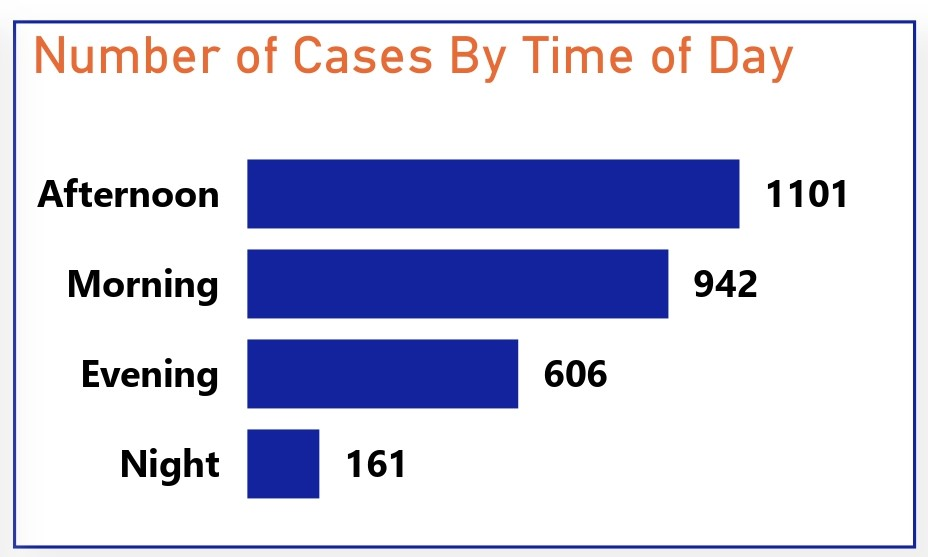

# Shark Attacks Analysis (1900-2017)

 

## Table of Contents
- [Project Overview](#project-overview)
- [Dataset Overview](#dataset-overview)
- [Tools Used](#tools-used)
- [Visualization in Power BI](#visualization-in-power-bi)
- [Project Analysis](#project-analysis)
- [Visuals in Power BI Report](#visuals-in-power-bi-report)
- [Recommendations On Mitigating Shark Attack Risks](#recommendations-on-mitigating-shark-attack-risks)
 

## Project Overview

### Introduction:
The __Shark Attacks Analysis (1900-2017)__ project aims to investigate and analyze global shark attack data to gain insights into the patterns, trends, and factors associated with shark attacks. Through the examining of this data, geographical locations, species involved, environmental conditions, and human activities, the project seeks to provide an understanding of shark attacks, their frequency, and potential risk factors. Sharks Atacks Analysis contains Shark attacks reported over the past 100 years, including location, activity, victim info (name, gender, age), shark species, etc. The project aims to explore and analyze sharks attacks all around the world.

### Objectives:
### Introduction:
The __Shark Attacks Analysis (1900-2017)__ project aims to investigate and analyze global shark attack data to gain insights into the patterns, trends, and factors associated with shark attacks. Through the examining of this data, geographical locations, species involved, environmental conditions, and human activities, the project seeks to provide an understanding of shark attacks, their frequency, and potential risk factors. Sharks Atacks Analysis contains Shark attacks reported over the past 100 years, including location, activity, victim info (name, gender, age), shark species, etc. The project aims to explore and analyze sharks attacks all around the world.

### Objectives:
- Analyze the data on shark attacks annually since 1900, and identify trends and patterns in shark attack occurrences over time.
- Identify the countries with the highest reported incidences of shark attacks and determine the specific areas and locations within those countries that exhibit higher levels of risk, providing insights into geographic hotspots for shark-human interactions.
- Practice data cleaning skills by preparing the raw dataset for analysis, ensuring consistency, accuracy, and suitability for further investigation.
- Perform text analysis on the "Injury" column to determine the body parts most frequently injured in shark attacks, providing valuable insights into the severity and nature of shark-related injuries.
- Transform the "Time" data to analyze the timing of shark attacks and ascertain whether certain parts of the day are associated with increased occurrence of shark-human interactions.
- Clean and analyze the data related to shark species involved in attacks to identify the species most frequently implicated in shark attacks, despite potential data inconsistencies and inaccuracies.

### Expected Outcomes:
- A comprehensive visualization illustrating the trends and patterns of shark attacks annually since 1900, facilitating a deeper understanding of the temporal evolution of shark-human interactions.
- Identification of countries with the highest incidence rates of shark attacks and pinpointing specific regions within these countries where shark encounters are most prevalent, aiding in the development of targeted safety measures and risk mitigation strategies.
- Cleaned and prepared dataset ready for analysis, ensuring reliable and accurate insights into various aspects of shark attacks.
- Insights into the body parts most commonly injured in shark attacks, informing medical and safety protocols for individuals at risk of shark encounters.
- Determination of whether certain times of day are associated with higher rates of shark attacks, potentially informing beach safety guidelines and public awareness campaigns.
- Identification of the shark species most frequently involved in attacks, despite data cleaning challenges, contributing to our understanding of species-specific behaviors and informing conservation efforts and management strategies aimed at reducing human-shark conflicts.
 
 

### Dataset Overview
The dataset used in this analysis is the "Attacks.csv" and was provided by [Quantum Analytics](https://www.quantumanalyticsco.org/). The "Attacks.csv" dataset contains information on shark attacks documented over some time. The dataset provides insights into various aspects of shark-human interactions, including the location, date, time, severity of injuries, shark species involved, and other relevant details about each recorded shark attack incident. You can access the dataset [here](attacks.csv).

This dataset has a single data table with 16 columns and 6,091 rows of data. Below is a description of the columns in this dataset for a better understanding of this analysis:
| Table                              | Field                    | Description                            |            
|:-----------------------------------|:------------------------ |:-------------------------------------- |
|attacks.csv                         | Case Number              | A unique identifier for each shark attack incident.   |
|                                    | Date                     | The date when the shark attack occurred.     |
|                                    | Year                     | The year in which the shark attack took place.        |
|                                    | Type                     | Describes the type of attack (e.g., provoked, unprovoked, invalid, etc.).       |
|                                    | Country                  | The country where the shark attack occurred.        |
|                                    | Area                     | The specific area or region within the country where the shark attack occurred.        |
|                                    | Location                 | Provides details about the location of the shark attack (e.g., beach name, geographical coordinates, etc.).      |
|                                    | Activity                 | Describes the activity being performed by the victim at the time of the shark attack.       |
|                                    | Name                     | Name of the individual involved in the shark attack incident.         |
|                                    | Sex                      | Gender of the individual involved in the shark attack.         |
|                                    | Age                      | Age of the individual involved in the shark attack.      |
|                                    | Injury                   | Specifies the type and severity of injuries sustained during the shark attack.        |
|                                    | Fatal (Y/N)              | Indicates whether the shark attack resulted in a fatality (Y for yes, N for no).       |
|                                    | Time                     | The time of day when the shark attack occurred.    |
|                                    | Species                  | Specifies the shark species involved in the attack, if known.        |
|                                    | Investigator or Source   | Provides information about the source of the data or the investigator who documented the shark attack incident.     |
 

### Skills Utilized
1. Data Cleaning
2. Data Visualiziation
3. Descriptive Analytics
4. Critical Thinking and Problem Solving
5. Communication and Reporting
 

### Tools Used
1. Power Query Editor
    - Was used to:
        1. Extract,
        2. Transform, and
        3. Load all the datasets for this analysis.
           
2. Power BI (Was used to create reports and dashboard for this analysis)
    - The following Power BI Features were incorporated:
        1. DAX
        2. Quick Measures
        3. Page Navigation
        4. Filters
        5. Tooltips
        6. Button
 

### Data Cleaning, Transformation and Loading using the Excel and Power Query Editor:
1. Changed the columns
2. The total number of data rows before cleaning was 6,091 rows and it was reduced to 5,940 rows after cleaning.
 

**Raw Data**
- Below a screenshot of a part of the raw data in .csv file format. You can access the dataset [here](attacks.csv).

 

**Final Power Query Editor screenshot**
- Below is a screenshot of a part of the cleaned data in power query editor. You can access the full Power BI project document [here](https://github.com/Ugochukwuodinaka/Shark-Attacks-Analysis/blob/main/SHARK%20ATTACKS%20DATA%20ANALYSIS.pbix).

 
 

## Data Modelling
No data modelling was required since we need just a table for the analysis.
 
 

## Visualization in Power BI:
#### Report View 1

#### Report View 2

 
 

### Project Analysis:
From the analysis, i made the following Key findings below:
- The Total Number of Shark Attack Cases is __5,956.__
- The Total Number of Survivors are __4,341.__
- The Total Number of Fatalities are __1,515.__
 
 

- 

- **Casualty Cases By Activity:**
- In my analysis of the top 10 shark attack cases by activity, valuable insights are provided into the activities most commonly associated with shark-human interactions. Here are some key observations and insights:
- __Surfing Tops:__ Surfing emerges as the activity with the highest number of shark attack cases, totaling 934 incidents. This finding is consistent with the known behavior of sharks, which may mistake surfers paddling on surfboards for prey due to their silhouette and movement resembling that of potential prey species.
- __Swimming Vulnerability:__ Swimming ranks second in terms of shark attack cases, with 861 incidents recorded. Swimmers often spend extended periods in the water, potentially increasing the likelihood of encountering sharks. Additionally, swimmers may inadvertently attract sharks by splashing and creating disturbance in the water.
- __Fishing and Spear Fishing:__ Fishing-related activities, including fishing and spear fishing, account for a significant number of shark attack cases, with 419 and 328 incidents, respectively. These activities involve the use of bait and blood, which can attract sharks to the vicinity, increasing the risk of encounters.
- __Passive Activities:__ Activities such as bathing, wading, and standing are also associated with shark attack cases, albeit to a lesser extent compared to more active pursuits like surfing and swimming. Despite being relatively passive activities, individuals engaged in these activities are still susceptible to shark encounters, highlighting the unpredictable nature of shark behavior.
- __Diving and Snorkeling:__ Diving and snorkeling, which involve exploring underwater environments, have recorded fewer shark attack cases compared to other activities. However, these activities still carry inherent risks, especially in areas known to have high shark populations or where feeding behavior occurs.
- It is important to note that we have rows of data where the case activity wasn't provided, so we classfied this activity as "Not Provided" which has 511 cases. These cases highlight potential underestimation of risks associated with water-based activities and emphasize the importance of improving reporting completeness. 
 
 

- 

- **Number of Cases By Time of Day:**
- The analysis on the number of shark attack cases by time of day provides insights attacks distribution across the different periods of the day. Here are some key observations and insights:
- __Unprovided Cases Prevalence:__ The category of unprovided cases, totaling 3,146 instances, stands out as the highest among all time categories. This suggests a significant portion of the dataset lacks specific information regarding the time of day when shark attacks occurred. The prevalence of unprovided cases underscores the importance of complete and accurate data collection for conducting thorough analyses and understanding temporal patterns in shark attacks.
- __Afternoon Activity:__ Afternoon emerges as the time period with the second-highest number of shark attack cases, totaling 1,101 instances. The afternoon hours typically coincide with peak recreational activities in coastal areas, such as swimming, surfing, and diving, which may contribute to increased human presence in the water and higher likelihood of shark encounters.
- __Morning and Evening Incidents:__ Shark attack cases during the morning and evening hours are also notable, with 942 and 606 cases recorded, respectively. These time periods likely represent times when individuals engage in water-based activities, albeit to a lesser extent compared to the afternoon. Factors such as varying environmental conditions, prey availability, and human behavior may influence shark activity and interactions during these times of day.
- __Nighttime Vulnerability:__ The dataset records the fewest shark attack cases during the night, with only 161 instances reported. Nighttime activities in coastal areas are typically less common due to reduced visibility and safety concerns, potentially resulting in fewer opportunities for shark-human interactions. However, individuals engaged in night fishing or other nocturnal activities may still be at risk of encountering sharks.
 
 

- 

- **Number of Cases By Sex:**
- The data on the number of shark attack cases by sex provides insights into the gender distribution among individuals involved in these attacks. Key observations and insights on this is stated below:
- __Male Majority:__ The dataset indicates a significant predominance of male individuals among shark attack cases, with 4,820 incidents recorded. This finding suggests that males are more frequently involved in activities or situations that increase the likelihood of shark encounters, such as surfing, swimming, and diving, which are traditionally male-dominated recreational pursuits in coastal areas.
- __Female Representation:__ Female individuals account for a substantially lower number of shark attack cases, with 591 incidents reported. This disparity may reflect differences in activity participation rates between genders, with females potentially engaging in water-based activities less frequently or in different contexts compared to males. Additionally, societal factors or cultural norms may influence gender-specific behaviors and risk-taking tendencies in aquatic environments.
- __Unprovided Sex Information:__ A notable portion of the dataset comprises cases where the sex of the individual involved was not provided and was categorized as N/A, totaling 537 instances. The absence of sex information for these cases underscores the need for more enhanced data collection practices to ensure accurate reporting and analysis of shark attack incidents
 
 

- 

- **Number of Cases By Survivors or Fatalities:**
- This data analysis provides insights into the outcomes of shark-human interactions, including the proportion of individuals who survived the attacks compared to those who succumbed to their injuries. Here are some key observations and insights derived from the provided information:
- __Survival Rate:__ The majority of individuals involved in shark attack incidents survived, with 4,341 cases recorded as survivors. This accounts for approximately 72.93% of all reported cases, indicating that the majority of shark encounters result in non-fatal outcomes.
- __Fatalities:__ Despite the relatively high survival rate, a significant number of shark attack cases resulted in fatalities, with 1,515 deaths reported. Fatalities represent approximately 25.45% of all reported cases, highlighting the serious and potentially life-threatening nature of shark attacks. 
- __Unknown Outcomes:__ A small proportion of shark attack cases (96 instances) have unknown survivor or fatality status, accounting for approximately 1.61% of the total cases. The absence of information regarding the outcome of these cases shows the need for a better data collection and reporting strategy to ensure accurate assessment and analysis of shark attack incidents.
 
 

- 

- **Top 10 Countries With Most Number of Cases By Surivors and Fatalities:**
- This analysis is on the top 10 countries with the most number of shark attack cases, categorized by survivors and fatalities. Below are some key observations and insights:
- __United States (USA) Tops:__ The United States emerges as the country with the highest number of reported shark attack cases, totaling 2,140 incidents. Despite the high number of cases, the majority of individuals involved in shark attacks in the USA survived, with 1,868 cases recorded as survivors. However, fatalities still occurred, with 248 reported deaths. The USA's coastal regions, particularly in states such as Florida, California, and Hawaii, are known for their high shark activity, attracting both tourists and residents engaged in water-based activities.
- __Australia and South Africa:__ Australia and South Africa follow closely behind the USA in terms of reported shark attack cases. Australia recorded 1,287 cases, with a relatively high number of fatalities (334) compared to survivors (928). South Africa reported 560 cases, with 425 survivors and 130 fatalities. These countries are renowned for their diverse marine ecosystems and attract water enthusiasts from around the world, contributing to the frequency of shark-human interactions.
- __Varied Survivor-Fatality Ratios:__ The data reveals varying survivor-fatality ratios across different countries. For instance, Papua New Guinea reported 129 cases, with 73 survivors and 54 fatalities, indicating a relatively high fatality rate compared to other countries. In contrast, countries like the Bahamas and New Zealand recorded lower fatality rates, with a higher proportion of survivors compared to fatalities.
- __Factors Influencing Survivorship:__ Factors such as prompt medical attention, access to emergency services, and public awareness of shark attack risks can influence survivorship rates. Countries with well-developed emergency response systems and public safety campaigns may have higher survivorship rates, as seen in the case of the USA and Australia.
 
 

- 

- **Shark Attack Trend By Year Since 1900:**
- In this analysis, i provided insights into the temporal evolution of shark-human interactions and the associated outcomes. Here are some key observations and insights for this analysis:
- __Overall Trend:__ The total number of reported shark attack cases has exhibited variability over the years, with fluctuations observed across different time periods. While there is no clear linear trend, the data reflects periods of both increase and decrease in the number of reported shark attacks, suggesting temporal variability in shark activity and human exposure to shark encounters.
- __Fatalities and Survivors:__ The data also highlights the outcomes of shark attacks in terms of fatalities and survivors. The number of fatalities varies from year to year, with some years recording higher numbers of fatalities compared to others. Similarly, the number of survivors fluctuates over time, reflecting differences in the severity of shark attacks, effectiveness of emergency response measures, and individual resilience in overcoming shark-related injuries.
- __Peaks and Troughs:__ Certain years stand out as notable peaks or troughs in shark attack activity. For example, the early 1900s saw relatively low numbers of reported shark attacks, followed by a notable increase in the early 1920s. Peaks in shark attack activity are also observed in the late 1930s, early 1940s, late 1950s, and late 1990s. These fluctuations may be influenced by various factors, including changes in environmental conditions, human population growth and coastal development, shifts in shark populations, and advancements in data collection and reporting practices.
- __Recent Trends:__ In more recent years, the data shows a general increase in the number of reported shark attacks, with notable peaks observed in the early 2000s and mid-2010s. While improvements in data collection and reporting may contribute to some extent to the observed increase, changes in human behavior, coastal recreational activities, and environmental factors may also play significant roles in shaping recent trends in shark attack activity.
 
 

- 

- **Number of Cases By Age Band:**
- This analysis provides valuable insights into the demographic distribution of shark-human interactions and the associated risk factors for different age groups. Observations and insights below:
- __Adult Predominance:__ Adults comprise the majority of individuals involved in shark attack incidents, accounting for 2,360 cases, or approximately 70.53% of the total cases. This finding is consistent with the notion that adults are more likely to engage in water-based activities such as surfing, swimming, and diving, which may increase their exposure to potential shark encounters. The high percentage of adult victims underscores the importance of targeted beach safety measures and public awareness campaigns aimed at this demographic group.
- __Teenager Vulnerability:__ Teenagers represent a significant proportion of shark attack victims, with 701 cases documented, accounting for approximately 20.95% of the total cases. Adolescents may engage in risk-taking behaviors or participate in water-related activities without fully understanding the associated risks, making them vulnerable to shark encounters. Educating teenagers about shark attack risks, promoting responsible behavior, and providing guidance on safety precautions can help reduce their vulnerability to shark attacks.
- __Children and Elderly:__ While children and the elderly are less frequently involved in shark attack incidents compared to adults and teenagers, they still comprise a notable proportion of victims. Children account for 203 cases, or 6.07% of the total cases, while the elderly represent 82 cases, or 2.45% of the total cases. Children may be more vulnerable to shark attacks due to their smaller size and inability to recognize potential dangers in aquatic environments, while elderly individuals may have reduced mobility or sensory capabilities, making it challenging to evade shark encounters. Implementing age-appropriate safety guidelines and supervision protocols can help mitigate risks for these vulnerable populations.
- __Unknown Age Category:__ A significant number of shark attack cases (2,609 cases) were categorized as "Unknown," indicating that age data was not provided for these incidents. The absence of age information indicates the need for better data collection and handling practices for accurate assessment and analysis of shark attack incidents.
 
 

- 

- **Top 10 Location By Number of Cases:**
- In this analysis, valuable insights was provided into the geographic distribution and prevalence of shark-human interactions across different coastal areas. Here's an analysis of the key observations and trends:
- __New Smyrna Beach:__ New Smyrna Beach in Volusia County, Florida, emerges as the primary hotspot for shark attacks, with a substantial number of reported cases (163 incidents). This location's notoriety as the "shark attack capital of the world" is attributed to various factors, including its popularity among surfers, its proximity to inlet channels attracting sharks, and the abundant marine life in the area. The high number of incidents underscores the need for heightened awareness and safety measures for beachgoers.
- __Regional Concentration:__ Volusia County stands out as a region with multiple beaches featuring prominently among the top locations for shark attacks. Besides New Smyrna Beach, both Daytona Beach and Ponce Inlet register notable numbers of incidents (31 and 18 cases, respectively). This concentration suggests localized factors contributing to increased shark-human interactions, such as environmental conditions, human activities, and shark behavior patterns.
- __International Presence:__ The list includes international destinations known for shark attacks, such as Boa Viagem in Recife, Brazil, and Durban in South Africa. These locations attract tourists and water sports enthusiasts due to their warm waters and diverse marine ecosystems. However, they also experience elevated risks of shark encounters, necessitating effective management strategies to ensure public safety while preserving marine biodiversity.
 
 

- 

- **Top 10 Cases By Injury Type:**
- This analysis provides insights into the specific anatomical areas commonly affected during such encounters. Below is an analysis of the key observations and trends:
- __Predominance of Limb Injuries:__ The majority of reported shark attack injuries involve bites to limbs, particularly the feet, legs, hands, and arms. This highlights the vulnerability of extremities during shark encounters, as these body parts are often exposed and within reach of a shark's jaws during swimming, surfing, or other water-based activities.
- __Focus on Lower Extremities:__ Injuries to the feet, legs, and thighs are particularly prevalent among the top cases, with "Foot Bitten," "Leg Bitten," and variations such as "Left Foot Bitten" and "Right Foot Bitten" featuring prominently. The lower extremities are commonly targeted by sharks, possibly due to their movement resembling that of prey or the shark's natural hunting behavior.
- __Variation in Severity:__ While limb injuries are common, the severity of shark attack injuries can vary depending on factors such as the size and species of the shark, the depth and location of the bite, and the promptness of medical intervention. Severe injuries, such as traumatic amputations or extensive tissue damage, may occur in some cases, highlighting the potential life-threatening nature of shark attacks.
- __Importance of Hand and Arm Protection:__ Although less common than limb injuries, bites to the hands and arms still constitute a notable proportion of reported cases. Protecting these upper extremities through the use of appropriate gear, such as wetsuits or gloves, can help reduce the risk of injury and provide a layer of defense against shark bites during aquatic activities.
 
 

## Visuals in Power BI Report:
You can view and interact with this dashboard report on Shark Attacks (1900-2017) Analysis [here](https://app.powerbi.com/view?r=eyJrIjoiNzkwNjNhNTktZDUzZi00NzhhLThlYWQtY2IxOGYwMzliMDQyIiwidCI6IjdlYzI5NjU5LTNjZjItNGYzZi1hYmIzLWE3MjJlZGY3ZmYyZCJ9).
 
 
 

## Recommendations On Mitigating Shark Attack Risks:
- __Public Education:__ Awareness campaigns should be conducted on shark behavior and risks and also, guidelines should be provided to avoid high-risk behaviors near shorelines.
- __Beach Safety:__ There should be increased lifeguard presence and installation of warning signs. Technology should be utilized for real-time shark detection and alerts.
- __Technology and Innovation:__ There should be an investment in shark repellent technologies and a development of wearable safety devices for water enthusiasts.
- __Fisheries Management:__ There should be an implementation of sustainable fishing practices to maintain healthy shark populations and also, a collaboration with fishing communities to reduce incidental catches.
- __Community Engagement:__ There should be a collaboration fostered among stakeholders for comprehensive strategies, a promotion of citizen science initiatives and beach clean-ups for community involvement
 
 

## Thank You For Following Through!
